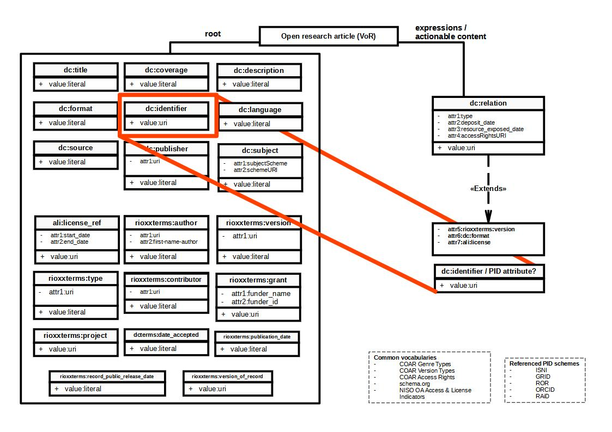

# Rioxx v3 - documenting data - 17 January 2023

This documentation arises from an RGG action emerging from the 09 December 2022, in turn emerging from [a recent audit of properties](https://github.com/antleaf/rioxx/issues/53). 

An audit of Rioxx properties and their semantics was initiated, with additional focus on those that might be usefully be contained within `dc:relation` to better communicate related but actionable resources. It is necessary to model these relationships within scholarly metadata since the scholarly publication process is increasingy fluid, often resulting in several expressions of the same intelletual object, as well as related entities (e.g. open data, software, etc.).

At time of writing, [release candidate 1](https://www.rioxx.net/profiles/v3-0-rc-1/) encompasses the following properties (Fig.1), with a division between resource description at the 'root' level (pertaining to the version of record (VoR) and those at the 'expression' or 'actionable' level.


*Fig.1 Rioxx v.3 properties in release candidate 1, with attributes and values indicated.*

The requirement to better describe related expressions and/or actionable resources necessitates that description of these related resources be enhanced. But it also requires that the semantics of these enhancements connect with existing properties in a semantically sensible way. Such an enhancement might occur within `dc:relation`.

`dc:relation` might therefore be extended to also include attributes for `rioxxterms:version`, `dc:format`, `ali:license`. (Fig.2) 

It should be noted that proposals arising from GitHub [issue 53](https://github.com/antleaf/rioxx/issues/53) highlighted a potential contradiction between the use of the `accessRightsURI` attribute (using the [COAR Access Rights vocabulary](https://vocabularies.coar-repositories.org/access_rights/)) and the potential need to express license content within `dc:relation`. For example, `accessRightsURI` communicates the (in)accessibility of a resource but does not communicate license conditions. Moreover, it remains semantically unsafe to declare `ali:license` at the root level but not at the related expression level where license conditions may differ.


*Fig.2 Possible additions to dc:relation within Rioxx v.3 properties in release candidate 2.*

The communication of both a related expression and harvestable resource (an accepted author manuscript) and a related resource (a dataset) might be expressed within Rioxx as follows:

```
<dc:relation type="https://schema.org/ScholarlyArticle" 
    deposit_date="2021-07-28" 
    resource_exposed_date="2021-07-28" 
    accessRightsURI="http://purl.org/coar/access_right/c_abf2" 
    rioxx_version="http://purl.org/coar/version/c_ab4af688f83e57aa" 
    format="application/pdf">
            https://www.repository.org/article_1234567.pdf
</dc:relation>

<dc:relation type="https://schema.org/DataSet" 
    accessRightsURI="http://purl.org/coar/access_right/c_abf2" 
    format="text/csv">
            https://doi.org/10.17868/dataset_123456
</dc:relation>

```

Note that the accepted author manuscript is treated more comprehensively. While the accepted manuscript is an expression of the VoR, it is also a resource upon which harvesting software may take action. Inclusion of these attributes is dependent on the relation type and therefore would be 'optional'.

Accepting that it is necessary communicate license data within these relations too, we might also accept that using both [schema.org](https://schema.org/) and [COAR Resource Type Genres](https://vocabularies.coar-repositories.org/resource_types/) within Rioxx may cause confusion or contradiction. schema.org affords greater general interoperability but, as a vocabulary, lacks specificity in defining expressions of scholarly objects, such as preprints, and lacks detail in data or software type description. We might therefore incorporate both license declarations and COAR Resource Types as follows:

```
<dc:relation type="http://purl.org/coar/resource_type/c_6501" 
    deposit_date="2021-07-28" 
    resource_exposed_date="2021-08-03" 
    rioxx_version="http://purl.org/coar/version/c_ab4af688f83e57aa"
    accessRightsURI="http://purl.org/coar/access_right/c_abf2"
    license="http://creativecommons.org/licenses/by/4.0/"
    format="application/pdf">
            https://www.repository.org/article_1234567.pdf
</dc:relation>

<dc:relation type="http://purl.org/coar/resource_type/c_cb28" 
    accessRightsURI="http://purl.org/coar/access_right/c_abf2" 
    format="text/csv">
            https://doi.org/10.17868/dataset_123456
</dc:relation>

```

The above example resolves licensing contradictions and improves the declaration of relation type.

## dc:identifier: a description level inconsistency to be resolved

The Rioxx release candidate 1 documents a change in the use of `dc:idenitifier`. As the Schema documentation notes:

> dc:identifier MUST contain an HTTP(S) URI which is a persistent identifier for the resource. In repositories, this is typically a webpage which includes links to other related resources. It is RECOMMENDED that that a DOI, Handle, URN, or other persistent identification scheme be used. In the common case of a "splash-page" linking to related files (potentially in different formats), then one or more instances of the dc:relation property may be included in the Rioxx record to convey this and thereby direct harvesting software agents.

> Note that dc:identifier should not be confused with rioxxterms:version_of_record.

In other words, `dc:identifier` is to be used to 'persistently identify' the resource, as per technical requirements arising from a growing number of policies, e.g. Plan S, UKRI Open Access Policy, etc. Meanwhile `dc:relation` encodes the *harvestable* location of the scholarly resource and `rioxxterms:version_of_record` encodes an idenitifier for the *VoR*. However, if the distinction between root and expression/actionable levels is to be coherently maintained, then encoding `dc:identifier` at the root level potentially introduces inconsistency because the content of `dc:identifier` pertains to data at the expression level (i.e. within `dc:relation`).

Root level description pertains to the VoR. Inclusion of, say, a persistent identifier within `dc:identifier` resolving to a scholarly open repository disrupts the root-expression 'model'. Maintaining this model would therefore entail the inclusion of `dc:identifier` or a variant attribute within `dc:relation`, e.g. a `pid` attribute: 



```

<dc:relation type="http://purl.org/coar/resource_type/c_6501" 
    deposit_date="2021-07-28" 
    resource_exposed_date="2021-08-03" 
    rioxx_version="http://purl.org/coar/version/c_ab4af688f83e57aa"
    pid="https://doi.org/10.17868/accepted-manuscript-doi"
    accessRightsURI="http://purl.org/coar/access_right/c_abf2"
    license="http://creativecommons.org/licenses/by/4.0/"
    format="application/pdf">
            https://www.repository.org/article_1234567.pdf
</dc:relation>

<dc:relation type="http://purl.org/coar/resource_type/c_cb28" 
    accessRightsURI="http://purl.org/coar/access_right/c_abf2" 
    format="text/csv">
            https://doi.org/10.17868/dataset_123456
</dc:relation>

```

This solution makes some conceptual sense, and at first appears workable, but there are consequences:

* It creates redundancy in the use of `dc:identifier` at the root level, in turn prompting questions about the need for `rioxxterms:version_of_record` if the same data can be expressed within `dc:identifier `. 
* It may introduce uncertainty in the property content of `dc:relation`. Since `dc:relation` is being used to capture both expressions/actionable resources *and* 'dumb' relations to, say, research data or software, the solution presented means that idenitifiers of various flavours will be expressed as property content in some instances, and as attributes -- but also not at all or in varied permutations.

This is an issue needs resolving by the RGG.

## 'Root' level vs. 'Expression/actionable' level

Maintaining the distinction between resource description within Rioxx at the 'root' and 'expression / actionable' levels is key to ensuring semantic consistency within the Schema. It may be necessary for the RGG to consider re-structuring the Rioxx Schema documentation to communicate the different levels of description since confusion in its application may arise without it. This may entail an expansion of the 'Terminology' section which appears in the opening passages of the documentation, or separating `dc:relation` into a separate section, thereby emphasizing the distinction. This may also aid in communicating the importance of `dc:relation` to harvesting. 

The quasi-FRBR-ized approach within the Schema echoes previous attempts to better encode relational associations, particularly within the Scholarly Works Application Profile (SWAP). However, unlike SWAP which deployed a FRBR model and which made this model explicit within its documentation, Rioxx uses similar modelling concepts but does not communicate this in the documentation. 


